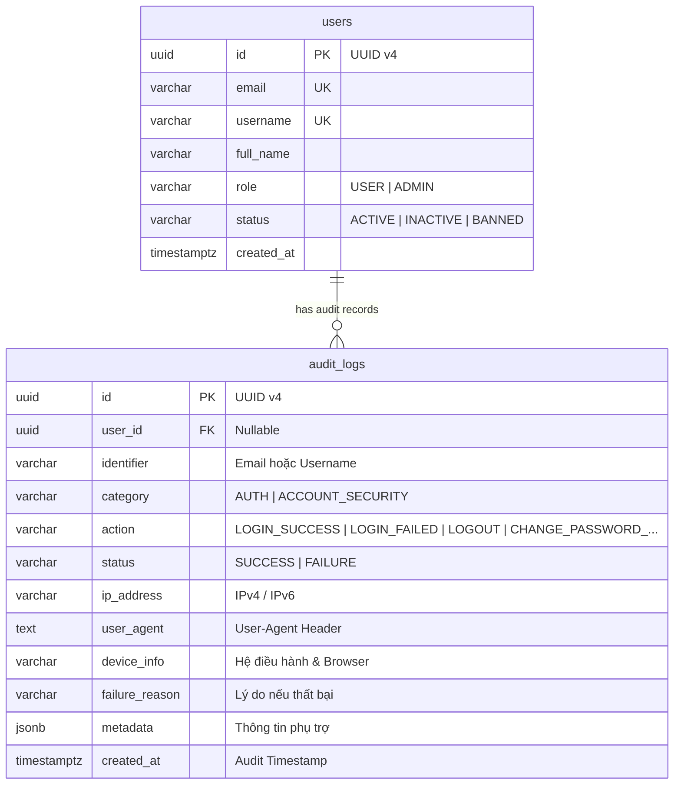
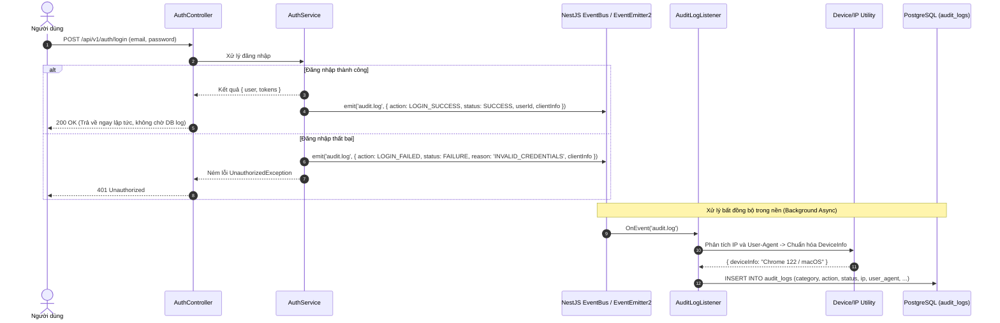

# Thiết kế cơ bản (Basic Design): Module Audit Logs (Nhật ký Kiểm toán Hoạt động & Bảo mật)

Tài liệu thiết kế cơ bản cho hệ thống ghi vết kiểm toán (**Audit Log System**), chịu trách nhiệm theo dõi, ghi nhận và lưu trữ toàn bộ các thao tác nhạy cảm liên quan đến danh tính và an ninh tài khoản (**Đăng nhập, Đăng xuất, Đổi mật khẩu, Thay đổi quyền**) cho hệ thống Social Network API.

---

## 1. Tổng quan & Mục tiêu

Hệ thống **Audit Logs** đóng vai trò là xương sống cho việc giám sát an ninh (Security Monitoring), phát hiện xâm nhập (Intrusion Detection) và đáp ứng các tiêu chuẩn bảo mật dữ liệu:
- **Ghi nhận toàn bộ thao tác xác thực & bảo mật tài khoản**:
  - `LOGIN_SUCCESS`: Đăng nhập thành công.
  - `LOGIN_FAILED`: Đăng nhập thất bại (ghi nhận lý do: sai mật khẩu, tài khoản không tồn tại, tài khoản bị khóa).
  - `LOGOUT`: Đăng xuất khỏi hệ thống.
  - `CHANGE_PASSWORD_SUCCESS`: Đổi mật khẩu thành công.
  - `CHANGE_PASSWORD_FAILED`: Đổi mật khẩu thất bại (sai mật khẩu cũ, mật khẩu mới không hợp lệ).
  - `RESET_PASSWORD`: Yêu cầu hoặc hoàn tất đặt lại mật khẩu qua email.
- **Thu thập ngữ cảnh toàn diện (Contextual Metadata)**:
  - Địa chỉ IP thực của người dùng (`ip_address`).
  - Chuỗi định danh thiết bị & trình duyệt (`user_agent`, `device_info`).
  - Thời gian thực hiện chuẩn UTC (`created_at`).
  - Dữ liệu bổ sung dạng JSON (`metadata`).
- **Nguyên tắc kiến trúc cốt lõi**:
  - **Phi chặn (Non-blocking & Asynchronous)**: Ghi log hoàn toàn bất đồng bộ thông qua Event Bus (`EventEmitter2`) hoặc Message Queue (AWS SQS / Redis), không gây tăng độ trễ (latency) của các API chính.
  - **Tính bất biến (Append-Only / Tamper-Proof)**: Dữ liệu audit log chỉ được phép thêm mới (`INSERT`) và truy vấn (`SELECT`), cấm hoàn toàn hành vi sửa đổi (`UPDATE`) hoặc xóa tùy tiện (`DELETE`).
  - **Lưu trữ & Phân vùng (Partitioning & Retention)**: Thiết kế hỗ trợ lượng dữ liệu lớn và phân vùng theo thời gian.

---

## 2. Mô hình dữ liệu (Data Model)

### 2.1. Bảng `audit_logs`

Kế thừa trường `id` UUID v4 và `created_at` từ `BaseEntity`.

| Tên cột | Kiểu dữ liệu | Bắt buộc | Khóa / Chỉ mục | Mô tả / Giá trị mặc định |
| :--- | :--- | :---: | :---: | :--- |
| `id` | UUID | Có | PK | Khóa chính tự sinh (UUID v4) |
| `user_id` | UUID | Không | FK, Index | ID người dùng thực hiện (null nếu login thất bại với tài khoản không tồn tại) |
| `identifier` | VARCHAR(255) | Có | Index | Email hoặc username người dùng nhập khi thao tác |
| `category` | VARCHAR(50) | Có | Index | Nhóm hành động: `AUTH`, `ACCOUNT_SECURITY`, `ADMIN_ACTION` |
| `action` | VARCHAR(50) | Có | Index | Tên hành động cụ thể (xem Enums) |
| `status` | VARCHAR(20) | Có | Index | Trạng thái: `SUCCESS`, `FAILURE` |
| `ip_address` | VARCHAR(45) | Có | Index | Địa chỉ IPv4 hoặc IPv6 của client |
| `user_agent` | TEXT | Không | - | Chuỗi User-Agent gốc từ HTTP Request Header |
| `device_info` | VARCHAR(150) | Không | - | Thiết bị/trình duyệt đã chuẩn hóa (ví dụ: `iOS 17 Mobile`, `Chrome 122 / macOS`) |
| `failure_reason` | VARCHAR(255) | Không | - | Mã hoặc lý do lỗi chi tiết nếu thất bại |
| `metadata` | JSONB | Không | - | Dữ liệu ngữ cảnh bổ sung (ví dụ: headers, location, token_id) |
| `created_at` | TIMESTAMPTZ | Có | Index (DESC) | Thời điểm ghi nhận hành động |

---

### 2.2. Các Enums liên quan

```typescript
export enum AuditCategory {
  AUTH = 'AUTH',
  ACCOUNT_SECURITY = 'ACCOUNT_SECURITY',
  ADMIN_ACTION = 'ADMIN_ACTION',
}

export enum AuditAction {
  LOGIN_SUCCESS = 'LOGIN_SUCCESS',
  LOGIN_FAILED = 'LOGIN_FAILED',
  LOGOUT = 'LOGOUT',
  REFRESH_TOKEN = 'REFRESH_TOKEN',
  CHANGE_PASSWORD_SUCCESS = 'CHANGE_PASSWORD_SUCCESS',
  CHANGE_PASSWORD_FAILED = 'CHANGE_PASSWORD_FAILED',
  FORGOT_PASSWORD_REQUEST = 'FORGOT_PASSWORD_REQUEST',
  RESET_PASSWORD_SUCCESS = 'RESET_PASSWORD_SUCCESS',
}

export enum AuditStatus {
  SUCCESS = 'SUCCESS',
  FAILURE = 'FAILURE',
}
```

---

### 2.3. Sơ đồ thực thể quan hệ (ERD)



---

## 3. Kiến trúc luồng xử lý phi chặn (Asynchronous Architecture)

Để đảm bảo hiệu năng tối ưu, việc lưu Audit Log diễn ra theo mô hình **Event-Driven phi chặn**:



---

## 4. Đặc tả API Endpoints

Tiền tố chung: `/api/v1/audit-logs`

### 4.1. `GET /api/v1/audit-logs/me`
- **Mô tả**: Cho phép người dùng đang đăng nhập xem lịch sử bảo mật cá nhân (ví dụ: các lần đăng nhập gần đây, đổi mật khẩu).
- **Quyền truy cập**: Authenticated (`Bearer <accessToken>`).
- **Query Params**:
  - `page`: Số trang (mặc định: `1`).
  - `limit`: Số bản ghi mỗi trang (mặc định: `10`, tối đa: `50`).
- **Response**: `200 OK`
  ```json
  {
    "statusCode": 200,
    "data": {
      "items": [
        {
          "id": "7fa1bc82-0192-4f2a-8c65-b1a9e88029d1",
          "action": "LOGIN_SUCCESS",
          "status": "SUCCESS",
          "ipAddress": "14.241.23.10",
          "deviceInfo": "Chrome 122 / macOS",
          "createdAt": "2026-10-02T19:00:00.000Z"
        },
        {
          "id": "e4b3e811-9a42-4f36-8a71-6c1cf6ec32b9",
          "action": "CHANGE_PASSWORD_SUCCESS",
          "status": "SUCCESS",
          "ipAddress": "14.241.23.10",
          "deviceInfo": "Chrome 122 / macOS",
          "createdAt": "2026-10-02T18:45:00.000Z"
        },
        {
          "id": "18c29012-32ba-4b21-9981-01928471ef01",
          "action": "LOGIN_FAILED",
          "status": "FAILURE",
          "failureReason": "INVALID_CREDENTIALS",
          "ipAddress": "113.161.40.55",
          "deviceInfo": "Safari Mobile / iOS",
          "createdAt": "2026-10-02T18:30:00.000Z"
        }
      ],
      "meta": {
        "totalItems": 15,
        "currentPage": 1,
        "totalPages": 2
      }
    }
  }
  ```

---

### 4.2. `GET /api/v1/audit-logs` (Dành cho Quản trị viên - Admin Portal)
- **Mô tả**: Xem và lọc toàn bộ nhật ký kiểm toán trong hệ thống.
- **Quyền truy cập**: Authenticated & Role `ADMIN` (`@Roles('ADMIN')`).
- **Query Params**:
  - `userId`: Lọc theo ID người dùng.
  - `identifier`: Tìm kiếm theo email hoặc username.
  - `action`: Lọc theo hành động (`LOGIN_FAILED`, `CHANGE_PASSWORD_SUCCESS`,...).
  - `status`: Lọc theo kết quả (`SUCCESS`, `FAILURE`).
  - `ipAddress`: Lọc theo địa chỉ IP nghi vấn.
  - `fromDate`, `toDate`: Khoảng thời gian (ISO-8601).
  - `page`, `limit`: Phân trang.
- **Response**: `200 OK` (Danh sách đầy đủ kèm thông tin User chi tiết).

---

### 4.3. `GET /api/v1/audit-logs/:id`
- **Mô tả**: Xem chi tiết 1 bản ghi kiểm toán kèm toàn bộ chuỗi metadata.
- **Quyền truy cập**: Authenticated (`ADMIN` hoặc chính chủ sở hữu bản ghi log).
- **Response**: `200 OK`

---

## 5. Quy chuẩn an ninh, Hiệu năng & Lưu trữ dài hạn

1. **Bảo toàn dữ liệu kiểm toán (Tamper-Proof Policy)**:
   - Cấu hình phân quyền trên Database PostgreSQL: user ứng dụng (`social_api_user`) chỉ có quyền `INSERT` và `SELECT` trên bảng `audit_logs`. Tuyệt đối không cấp quyền `UPDATE` và `DELETE`.
2. **Chống tấn công Brute-force & Cảnh báo an ninh**:
   - Dựa trên các bản ghi `LOGIN_FAILED` liên tiếp:
     - Nếu có `>= 5` lần đăng nhập thất bại từ cùng một `identifier` hoặc cùng một `ip_address` trong vòng 10 phút -> Hệ thống tự động kích hoạt Rate Limiting và gửi email cảnh báo bảo mật tới người dùng.
3. **Phân vùng bảng (Table Partitioning)**:
   - Với lượng truy cập lớn, bảng `audit_logs` được cấu hình phân vùng theo tháng dựa trên cột `created_at` (`PARTITION BY RANGE (created_at)`), giúp duy trì tốc độ truy vấn cao và quản lý vòng đời dữ liệu dễ dàng.
4. **Chính sách lưu trữ dài hạn (Data Retention)**:
   - Dữ liệu `audit_logs` được lưu trữ trực tiếp trên PostgreSQL trong vòng 90 ngày.
   - Định kỳ mỗi cuối tháng, dữ liệu cũ hơn 90 ngày được sao lưu tự động ra file Parquet nén và chuyển vào **AWS S3 Standard-IA / S3 Glacier** phục vụ kiểm toán dài hạn với chi phí lưu trữ tối thiểu.
