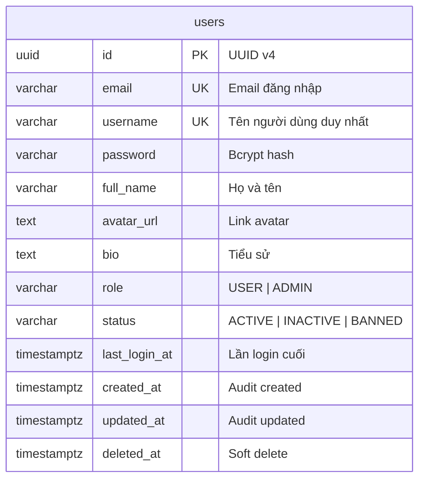
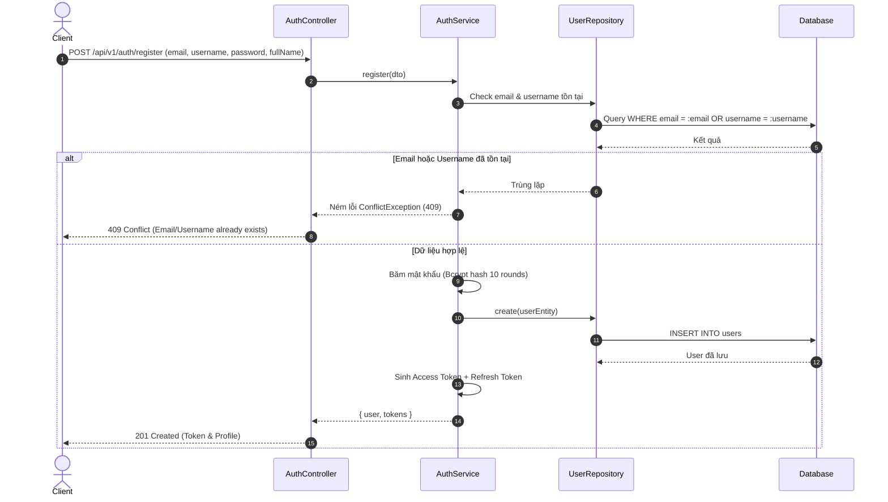
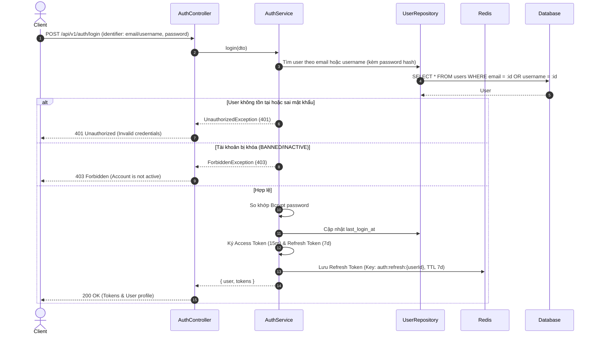
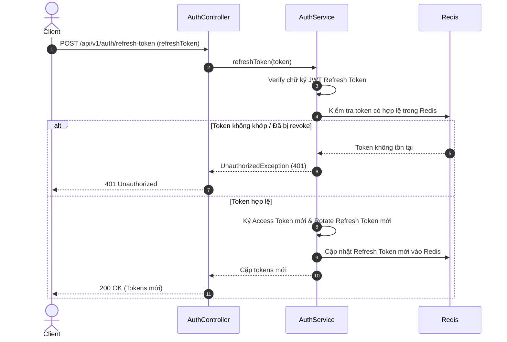
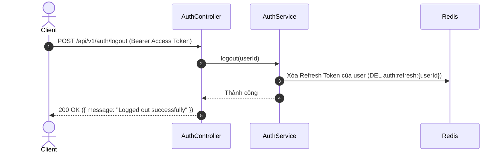

# Thiết kế cơ bản (Basic Design): Module Authentication & User

Tài liệu thiết kế cơ bản cho chức năng xác thực người dùng (**Authentication - Login, Register**) và mô hình dữ liệu người dùng (**User Model**) cho hệ thống Social Network API.

---

## 1. Tổng quan & Mục tiêu

Module **Authentication** chịu trách nhiệm quản lý danh tính và phiên truy cập của người dùng trong hệ thống:
- Cung cấp cơ chế đăng ký tài khoản mới (`Register`) với xác thực dữ liệu chặt chẽ.
- Cung cấp cơ chế đăng nhập (`Login`) cấp phát cặp token **JWT (Access Token & Refresh Token)**.
- Quản lý trạng thái phiên làm việc, hỗ trợ làm mới token (`Refresh Token`) và đăng xuất (`Logout`) thông qua Redis.
- Cung cấp thông tin tài khoản hiện tại (`Get Profile / Me`).
- Thiết lập mô hình dữ liệu **User Entity** chuẩn mực, kế thừa `BaseEntity` (hỗ trợ UUID, audit timestamps, soft-delete).

---

## 2. Mô hình dữ liệu (Data Model - User Entity)

### 2.1. Bảng `users`
Kế thừa cấu trúc từ `BaseEntity` (`id` UUID, `created_at`, `updated_at`, `deleted_at`).

| Tên cột | Kiểu dữ liệu | Bắt buộc | Khóa / Chỉ mục | Mô tả / Giá trị mặc định |
| :--- | :--- | :---: | :---: | :--- |
| `id` | UUID | Có | PK | Khóa chính tự sinh (UUID v4) |
| `email` | VARCHAR(255) | Có | Unique, Index | Email đăng nhập & liên lạc |
| `username` | VARCHAR(50) | Có | Unique, Index | Định danh duy nhất trên mạng xã hội (@username) |
| `password` | VARCHAR(255) | Có | - | Mật khẩu đã băm (Bcrypt), ẩn mặc định (`select: false`) |
| `full_name` | VARCHAR(100) | Có | - | Tên hiển thị người dùng |
| `avatar_url` | TEXT | Không | - | URL ảnh đại diện |
| `bio` | TEXT | Không | - | Tiểu sử / Giới thiệu bản thân |
| `role` | VARCHAR(20) | Có | - | Vai trò: `USER`, `ADMIN` (mặc định: `USER`) |
| `status` | VARCHAR(20) | Có | Index | Trạng thái: `ACTIVE`, `INACTIVE`, `BANNED` (mặc định: `ACTIVE`) |
| `last_login_at` | TIMESTAMPTZ | Không | - | Thời gian đăng nhập gần nhất |
| `created_at` | TIMESTAMPTZ | Có | - | Thời gian tạo tài khoản |
| `updated_at` | TIMESTAMPTZ | Có | - | Thời gian cập nhật gần nhất |
| `deleted_at` | TIMESTAMPTZ | Không | - | Thời gian xóa mềm (soft delete) |

### 2.2. Các Enums liên quan
```typescript
export enum UserRole {
  USER = 'USER',
  ADMIN = 'ADMIN',
}

export enum UserStatus {
  ACTIVE = 'ACTIVE',
  INACTIVE = 'INACTIVE',
  BANNED = 'BANNED',
}
```

### 2.3. Sơ đồ thực thể quan hệ (ERD)



---

## 3. Luồng xử lý nghiệp vụ (Business Workflows)

### 3.1. Luồng Đăng ký (Register)


### 3.2. Luồng Đăng nhập (Login)


### 3.3. Luồng Làm mới Token (Refresh Token)


### 3.4. Luồng Đăng xuất (Logout)


---

## 4. Đặc tả API Endpoints

Tất cả các route tuân thủ tiền tố chung `/api/v1/auth`:

### 4.1. `POST /api/v1/auth/register`
- **Mô tả**: Đăng ký người dùng mới.
- **Quyền truy cập**: Public (`@Public()`).
- **Request Body**:
  ```json
  {
    "email": "user@example.com",
    "username": "user123",
    "password": "StrongPassword@123",
    "fullName": "Nguyen Van A"
  }
  ```
- **Validation**:
  - `email`: định dạng email hợp lệ, tối đa 255 ký tự.
  - `username`: chữ cái thường, số, dấu gạch dưới `_`, từ 3-30 ký tự (`/^[a-z0-9_]{3,30}$/`).
  - `password`: tối thiểu 8 ký tự, gồm ít nhất 1 chữ hoa, 1 chữ thường, 1 số và 1 ký tự đặc biệt.
  - `fullName`: chuỗi ký tự không rỗng, từ 2-100 ký tự.
- **Response**: `201 Created`
  ```json
  {
    "statusCode": 201,
    "data": {
      "user": {
        "id": "b6a82741-2cbe-4c4f-a9cb-b61005d58ff3",
        "email": "user@example.com",
        "username": "user123",
        "fullName": "Nguyen Van A",
        "role": "USER",
        "status": "ACTIVE",
        "createdAt": "2026-10-02T15:00:00.000Z"
      },
      "tokens": {
        "accessToken": "eyJhbGciOi...",
        "refreshToken": "eyJhbGciOi...",
        "expiresIn": 900
      }
    }
  }
  ```

---

### 4.2. `POST /api/v1/auth/login`
- **Mô tả**: Đăng nhập lấy cặp JWT token.
- **Quyền truy cập**: Public (`@Public()`).
- **Request Body**:
  ```json
  {
    "identifier": "user@example.com",
    "password": "StrongPassword@123"
  }
  ```
- **Response**: `200 OK`
  ```json
  {
    "statusCode": 200,
    "data": {
      "user": {
        "id": "b6a82741-2cbe-4c4f-a9cb-b61005d58ff3",
        "email": "user@example.com",
        "username": "user123",
        "fullName": "Nguyen Van A",
        "avatarUrl": null,
        "role": "USER",
        "status": "ACTIVE"
      },
      "tokens": {
        "accessToken": "eyJhbGciOi...",
        "refreshToken": "eyJhbGciOi...",
        "expiresIn": 900
      }
    }
  }
  ```

---

### 4.3. `POST /api/v1/auth/refresh-token`
- **Mô tả**: Cấp mới Access Token khi hết hạn bằng Refresh Token hợp lệ.
- **Quyền truy cập**: Public (`@Public()`).
- **Request Body**:
  ```json
  {
    "refreshToken": "eyJhbGciOi..."
  }
  ```
- **Response**: `200 OK`
  ```json
  {
    "statusCode": 200,
    "data": {
      "accessToken": "eyJhbGciOi...",
      "refreshToken": "eyJhbGciOi...",
      "expiresIn": 900
    }
  }
  ```

---

### 4.4. `POST /api/v1/auth/logout`
- **Mô tả**: Đăng xuất, hủy bỏ Refresh Token trong Redis.
- **Quyền truy cập**: Authenticated (`Bearer <accessToken>`).
- **Response**: `200 OK`
  ```json
  {
    "statusCode": 200,
    "data": {
      "message": "Logged out successfully"
    }
  }
  ```

---

### 4.5. `GET /api/v1/auth/me`
- **Mô tả**: Lấy thông tin tài khoản đang đăng nhập.
- **Quyền truy cập**: Authenticated (`Bearer <accessToken>`).
- **Response**: `200 OK`
  ```json
  {
    "statusCode": 200,
    "data": {
      "id": "b6a82741-2cbe-4c4f-a9cb-b61005d58ff3",
      "email": "user@example.com",
      "username": "user123",
      "fullName": "Nguyen Van A",
      "avatarUrl": null,
      "bio": null,
      "role": "USER",
      "status": "ACTIVE",
      "createdAt": "2026-10-02T15:00:00.000Z"
    }
  }
  ```

---

## 5. Quy chuẩn bảo mật & kỹ thuật (Security & Technical Requirements)

1. **Mật khẩu**:
   - Sử dụng thuật toán `bcrypt` với `saltRounds = 10`.
   - Cột `password` trong Entity phải có cờ `{ select: false }` để đảm bảo không bị lộ khi query thông thường.
2. **Cấu hình JWT Token**:
   - **Access Token**: Hạn dùng ngắn (15 phút), chứa payload: `{ sub: user.id, email: user.email, role: user.role }`.
   - **Refresh Token**: Hạn dùng dài (7 ngày), mã hóa và xác thực chữ ký an toàn.
3. **Quản lý phiên Redis**:
   - Khóa lưu trữ: `auth:refresh:{userId}` lưu refresh token hiện thời.
   - Khi logout hoặc rotation, xóa/ghi đè key với thời gian TTL tương ứng.
4. **Xử lý lỗi**:
   - Sử dụng [HttpExceptionFilter](file:///Users/macos/project/personal/aws/social/social-api/src/common/filters/http-exception.filter.ts) đã có để format lỗi trả về theo chuẩn `statusCode, code, message, details, timestamp`.
   - Lỗi đăng nhập trả về mã `401 Unauthorized` chung (không chỉ rõ email sai hay mật khẩu sai để tránh user enumeration).
5. **Kế thừa kiến trúc**:
   - Entity kế thừa [BaseEntity](file:///Users/macos/project/personal/aws/social/social-api/src/shared/base.entity.ts).
   - Repository thao tác bảng `users` kế thừa [BaseRepository](file:///Users/macos/project/personal/aws/social/social-api/src/common/repositories/base.repository.ts).
