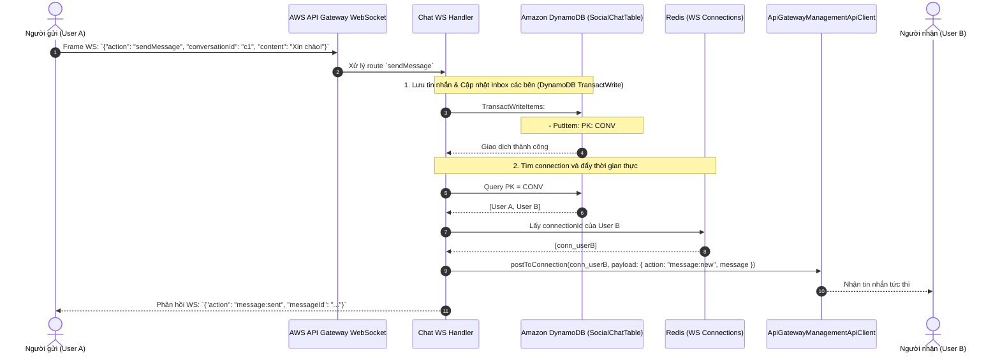
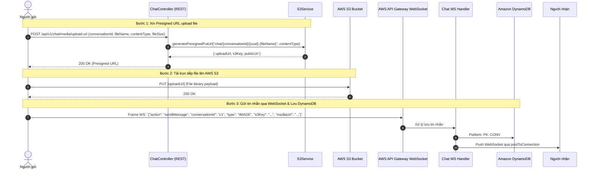

# Thiết kế cơ bản (Basic Design): Module Chat (Lưu trữ Amazon DynamoDB, AWS S3 & AWS WebSocket)

Tài liệu thiết kế cơ bản cho hệ thống nhắn tin tức thời (**Real-time Chat**) hỗ trợ trò chuyện 1-1 và trò chuyện nhóm (Group Chat). Toàn bộ dữ liệu cuộc hội thoại và tin nhắn được lưu trữ trên **Amazon DynamoDB** (NoSQL hiệu năng cao, mở rộng linh hoạt), kết hợp **AWS S3** lưu trữ tệp đa phương tiện và **AWS API Gateway WebSocket** truyền tải thời gian thực.

---

## 1. Tổng quan & Mục tiêu

Module **Chat** được thiết kế phục vụ hàng triệu người dùng đồng thời với độ trễ phản hồi cực thấp:
- **Lưu trữ dữ liệu trên Amazon DynamoDB**:
  - Toàn bộ thực thể hội thoại (`Conversations`), thành viên (`Members`) và tin nhắn (`Messages`) được lưu trữ trên DynamoDB thay vì RDBMS, tận dụng khả năng tự động co giãn (Auto-scaling), độ trễ đọc/ghi < 10ms ở quy mô lớn.
  - Áp dụng mẫu thiết kế **Single-Table Design** hoặc bảng chuyên biệt tối ưu với Partition Key (PK) và Sort Key (SK), hỗ trợ truy vấn danh sách hội thoại của người dùng và lịch sử tin nhắn cực nhanh.
- **AWS S3 (Lưu trữ Media Chat)**:
  - Cung cấp **Presigned URL** cho client tải ảnh, video, tin nhắn thoại (voice audio), file đính kèm trực tiếp lên S3.
- **AWS API Gateway WebSocket**:
  - Quản lý phiên kết nối liên tục qua các route: `$connect`, `$disconnect`, `sendMessage`, `typing`, `markAsRead`.
  - Quản lý `connectionId` của người dùng trên **Redis**.
  - Đẩy tin nhắn tức thời tới các thành viên hội thoại thông qua `ApiGatewayManagementApiClient.postToConnection()`.

---

## 2. Mô hình dữ liệu trên Amazon DynamoDB (Data Model)

Hệ thống sử dụng bảng DynamoDB: `SocialChatTable` (Single-Table Design) hoặc 2 bảng chuyên biệt tối ưu `ChatConversations` và `ChatMessages`. Dưới đây là thiết kế chuẩn theo mẫu **Single-Table Design** trên DynamoDB (`SocialChatTable`):

### 2.1. Thiết kế Bảng `SocialChatTable`

| Khóa chính | Tên trường | Kiểu dữ liệu | Mô tả |
| :--- | :--- | :---: | :--- |
| **Partition Key (PK)** | `PK` | String (S) | Khóa phân vùng phân tách đối tượng |
| **Sort Key (SK)** | `SK` | String (S) | Khóa sắp xếp dùng truy vấn khoảng (Range Query) |

#### Các định dạng PK / SK cho từng thực thể:

| Thực thể | Partition Key (PK) | Sort Key (SK) | Các thuộc tính dữ liệu khác (Attributes) |
| :--- | :--- | :--- | :--- |
| **Hội thoại của User** *(User Conversation Inbox)* | `USER#{userId}` | `CONV#{updatedAt}#{conversationId}` | `conversationId`, `type` (`DIRECT`/`GROUP`), `title`, `avatarUrl`, `lastMessage`: `{ content, senderId, type, createdAt }`, `unreadCount`, `role`, `updatedAt` |
| **Thông tin Hội thoại** *(Conversation Metadata)* | `CONV#{conversationId}` | `METADATA` | `conversationId`, `type`, `title`, `avatarUrl`, `createdBy`, `memberCount`, `createdAt`, `updatedAt` |
| **Thành viên Hội thoại** *(Conversation Member)* | `CONV#{conversationId}` | `MEMBER#{userId}` | `userId`, `role` (`ADMIN`/`MEMBER`), `joinedAt`, `lastReadMessageId` |
| **Tin nhắn** *(Chat Message)* | `CONV#{conversationId}` | `MSG#{timestamp}#{messageId}` | `messageId`, `senderId`, `type` (`TEXT`/`IMAGE`/`VIDEO`/`AUDIO`/`FILE`), `content`, `mediaUrl`, `s3Key`, `fileName`, `fileSize`, `replyToId`, `isRecalled`, `createdAt` |

---

### 2.2. Các mẫu truy vấn chính (Access Patterns trên DynamoDB)

1. **Lấy danh sách hộp thư hội thoại của User**:
   - `Query`: `PK = USER#{userId} AND SK begins_with "CONV#"`
   - `ScanIndexForward = false` (Sắp xếp theo thời gian mới nhất lên đầu).
   - Tốc độ đọc O(1) phân vùng, không cần JOIN phức tạp.
2. **Lấy lịch sử tin nhắn trong một cuộc hội thoại**:
   - `Query`: `PK = CONV#{conversationId} AND SK begins_with "MSG#"`
   - `ScanIndexForward = false` (lấy các tin nhắn mới nhất, hỗ trợ phân trang Cursor qua `ExclusiveStartKey`).
3. **Lấy danh sách thành viên trong cuộc hội thoại để broadcast WebSocket**:
   - `Query`: `PK = CONV#{conversationId} AND SK begins_with "MEMBER#"`
   - Lấy danh sách các `userId` cần gửi tin nhắn.
4. **Cập nhật tin nhắn đã đọc (Mark as Read)**:
   - `UpdateItem`: `PK = CONV#{conversationId}`, `SK = MEMBER#{userId}`, cập nhật `lastReadMessageId`.
   - `UpdateItem`: `PK = USER#{userId}`, `SK = CONV#{updatedAt}#{conversationId}`, đặt `unreadCount = 0`.

---

### 2.3. Các Enums liên quan

```typescript
export enum ConversationType {
  DIRECT = 'DIRECT',
  GROUP = 'GROUP',
}

export enum MessageType {
  TEXT = 'TEXT',
  IMAGE = 'IMAGE',
  VIDEO = 'VIDEO',
  AUDIO = 'AUDIO',
  FILE = 'FILE',
}

export enum MemberRole {
  ADMIN = 'ADMIN',
  MEMBER = 'MEMBER',
}
```

---

## 3. Luồng xử lý nghiệp vụ & Tương tác DynamoDB

### 3.1. Luồng Gửi tin nhắn Text & Ghi nhận vào DynamoDB



### 3.2. Luồng Gửi tin nhắn Media qua AWS S3 và DynamoDB



---

## 4. Đặc tả API REST & WebSocket Routes

### 4.1. WebSocket Routes (API Gateway WebSocket)

| Route Key | Hướng | Mô tả | Payload mẫu |
| :--- | :---: | :--- | :--- |
| `$connect` | Client -> Server | Khởi tạo kết nối, kèm JWT query param `?token=...` | - |
| `$disconnect` | Client -> Server | Ngắt kết nối, dọn dẹp Redis connection | - |
| `sendMessage` | Client -> Server | Gửi tin nhắn mới (ghi vào DynamoDB) | `{ "action": "sendMessage", "conversationId": "...", "content": "..." }` |
| `typing` | Client -> Server | Báo trạng thái đang gõ | `{ "action": "typing", "conversationId": "...", "isTyping": true }` |
| `markAsRead` | Client -> Server | Đánh dấu đã đọc tin nhắn | `{ "action": "markAsRead", "conversationId": "...", "messageId": "..." }` |
| `message:new` | Server -> Client | Đẩy tin nhắn mới tức thời | Message Object |
| `user:typing` | Server -> Client | Báo người dùng khác đang soạn thảo | `{ "conversationId": "...", "userId": "..." }` |

---

### 4.2. REST Endpoints (Tiền tố: `/api/v1/chat`)

#### 4.2.1. `POST /api/v1/chat/media/upload-url`
- **Mô tả**: Lấy Presigned URL để upload ảnh/video/tệp đính kèm tin nhắn lên AWS S3.
- **Quyền truy cập**: Authenticated (`Bearer <accessToken>`).
- **Request Body**:
  ```json
  {
    "conversationId": "6a9f1a23-45bb-4889-9a2f-1811e9a24c90",
    "fileName": "photo.jpg",
    "contentType": "image/jpeg",
    "fileSize": 2048000
  }
  ```
- **Response**: `200 OK` (uploadUrl, s3Key, fileUrl).

#### 4.2.2. `POST /api/v1/chat/conversations`
- **Mô tả**: Tạo cuộc hội thoại mới (1-1 hoặc nhóm), lưu các bản ghi khởi tạo vào DynamoDB.
- **Request Body**:
  ```json
  {
    "type": "DIRECT",
    "recipientId": "78a9c140-5b43-41bb-aef3-018274cbef01"
  }
  ```
- **Response**: `201 Created`

#### 4.2.3. `GET /api/v1/chat/conversations`
- **Mô tả**: Lấy danh sách hộp thư hội thoại của người dùng từ DynamoDB (`PK = USER#{userId}`).
- **Query Params**: `limit=20`, `cursor=...` (DynamoDB `ExclusiveStartKey`).
- **Response**: `200 OK`

#### 4.2.4. `GET /api/v1/chat/conversations/:id/messages`
- **Mô tả**: Lấy lịch sử tin nhắn của một cuộc hội thoại từ DynamoDB (`PK = CONV#{id} AND SK begins_with MSG#`).
- **Query Params**: `limit=30`, `cursor=...`.
- **Response**: `200 OK`

---

## 5. Tối ưu hóa DynamoDB & AWS S3

1. **DynamoDB DocumentClient & Batch/Transact Operations**:
   - Sử dụng `@aws-sdk/lib-dynamodb` với `TransactWriteCommand` khi gửi tin nhắn để đảm bảo tính toàn vẹn: lưu tin nhắn, cập nhật `lastMessage` của cuộc hội thoại, và tăng `unreadCount` của người nhận diễn ra đồng thời nguyên tử (Atomic).
2. **DynamoDB TTL (Time-To-Live)**:
   - Tùy chọn cấu hình thuộc tính `ttl` (ví dụ sau 1 năm hoặc 2 năm) để tự động xóa tin nhắn cũ mà không tốn chi phí đọc/xóa bảng.
3. **Quản lý Dead WebSocket Connection**:
   - Khi `postToConnection` trả về `GoneException (410)` -> Xóa `connectionId` khỏi Redis.
