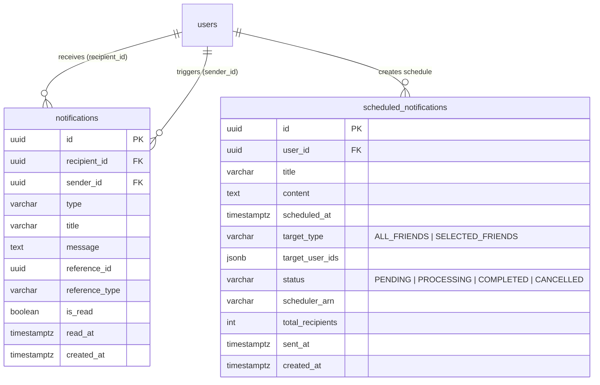
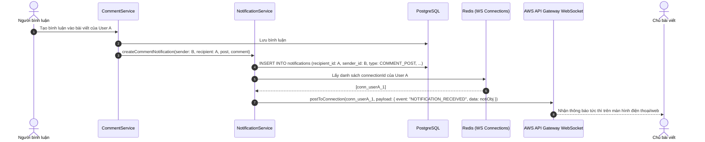
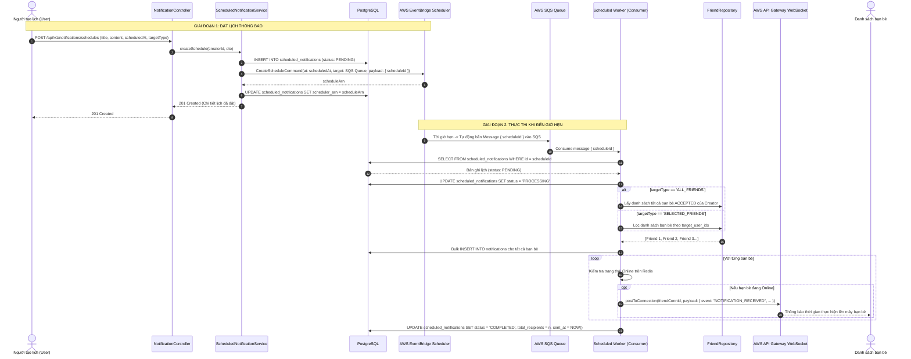

# Thiết kế cơ bản (Basic Design): Module Notification (Thông báo Real-time & Thông báo Lập lịch cho Bạn bè)

Tài liệu thiết kế cơ bản cho hệ thống thông báo (**Notification System**), bao gồm:
1. **Thông báo thời gian thực (Real-time In-App Notification via AWS WebSocket)**: Tức thời thông báo khi có người bình luận vào bài viết của mình, trả lời bình luận hoặc tương tác mạng xã hội.
2. **Thông báo lập lịch cho bạn bè (Scheduled Notification to Friends via AWS EventBridge Scheduler & SQS)**: Cho phép người dùng lên lịch gửi thông báo nhắc nhở, sự kiện, thiệp mừng tới toàn bộ hoặc nhóm bạn bè được chọn vào một thời điểm trong tương lai.

---

## 1. Tổng quan & Mục tiêu

Module **Notification** đóng vai trò tương tác và giữ chân người dùng trong hệ thống:
- **Thông báo sự kiện thời gian thực (Real-time Events)**:
  - Khi người dùng khác bình luận vào bài viết (`COMMENT_POST`), trả lời bình luận (`REPLY_COMMENT`), thích bài viết (`LIKE_POST`), gửi lời mời kết bạn (`FRIEND_REQUEST`), chấp nhận kết bạn (`FRIEND_ACCEPTED`).
  - Hệ thống tạo bản ghi thông báo trong PostgreSQL và đẩy ngay lập tức qua **AWS API Gateway WebSocket** tới các kết nối đang trực tuyến của người nhận.
- **Tính năng Thông báo lập lịch (Scheduled Notifications)**:
  - Người dùng có thể lên lịch gửi thông báo đến bạn bè của mình vào thời gian xác định trước (ví dụ: nhắc hẹn tiệc, thông báo sinh nhật, thông báo sự kiện cá nhân).
  - Tùy chọn phạm vi người nhận: Toàn bộ bạn bè (`ALL_FRIENDS`) hoặc danh sách bạn bè chọn lọc (`SELECTED_FRIENDS`).
  - Tích hợp dịch vụ phi máy chủ chuẩn của AWS: **AWS EventBridge Scheduler** + **AWS SQS / Worker** để kích hoạt tự động theo chuẩn xác thời gian thực mà không làm tiêu tốn tài nguyên hệ thống khi chờ đợi.

---

## 2. Mô hình dữ liệu (Data Model)

### 2.1. Bảng `notifications` (Thông báo người dùng nhận được)

Kế thừa `BaseEntity` (`id` UUID v4, `created_at`, `updated_at`, `deleted_at`).

| Tên cột | Kiểu dữ liệu | Bắt buộc | Khóa / Chỉ mục | Mô tả / Giá trị mặc định |
| :--- | :--- | :---: | :---: | :--- |
| `id` | UUID | Có | PK | Khóa chính tự sinh (UUID v4) |
| `recipient_id` | UUID | Có | FK, Index | Người nhận thông báo (tham chiếu `users.id`) |
| `sender_id` | UUID | Không | FK | Người tạo ra tương tác (tham chiếu `users.id`) |
| `type` | VARCHAR(30) | Có | Index | Phân loại thông báo (xem Enums) |
| `title` | VARCHAR(255) | Có | - | Tiêu đề thông báo |
| `message` | TEXT | Có | - | Nội dung chi tiết thông báo |
| `reference_id` | UUID | Không | Index | ID thực thể liên quan (ID bài viết, ID bình luận, v.v.) |
| `reference_type` | VARCHAR(50) | Không | - | Loại thực thể: `POST`, `COMMENT`, `FRIEND_REQUEST`, `SCHEDULE_REMINDER` |
| `is_read` | BOOLEAN | Có | Index | Trạng thái đã xem hay chưa (mặc định: `false`) |
| `read_at` | TIMESTAMPTZ | Không | - | Thời điểm người dùng đọc thông báo |
| `created_at` | TIMESTAMPTZ | Có | Index (DESC) | Thời gian tạo thông báo |

### 2.2. Bảng `scheduled_notifications` (Lịch gửi thông báo cho bạn bè)

| Tên cột | Kiểu dữ liệu | Bắt buộc | Khóa / Chỉ mục | Mô tả / Giá trị mặc định |
| :--- | :--- | :---: | :---: | :--- |
| `id` | UUID | Có | PK | Khóa chính tự sinh (UUID v4) |
| `user_id` | UUID | Có | FK, Index | Người tạo lịch thông báo (tham chiếu `users.id`) |
| `title` | VARCHAR(255) | Có | - | Tiêu đề thông báo gửi bạn bè |
| `content` | TEXT | Có | - | Nội dung thông báo gửi bạn bè |
| `scheduled_at` | TIMESTAMPTZ | Có | Index | Thời điểm dự kiến phát thông báo (UTC) |
| `target_type` | VARCHAR(20) | Có | - | Đối tượng: `ALL_FRIENDS`, `SELECTED_FRIENDS` |
| `target_user_ids` | JSONB | Không | - | Mảng UUID danh sách bạn bè nếu chọn `SELECTED_FRIENDS` |
| `status` | VARCHAR(20) | Có | Index | Trạng thái: `PENDING`, `PROCESSING`, `COMPLETED`, `CANCELLED` |
| `scheduler_arn` | VARCHAR(500) | Không | - | ARN của schedule trên AWS EventBridge Scheduler |
| `total_recipients` | INT | Không | - | Tổng số bạn bè đã nhận thông báo |
| `sent_at` | TIMESTAMPTZ | Không | - | Thời điểm thực tế đã phát tán thông báo |
| `created_at` | TIMESTAMPTZ | Có | - | Thời gian tạo lịch |
| `updated_at` | TIMESTAMPTZ | Có | - | Thời gian cập nhật |

### 2.3. Các Enums liên quan

```typescript
export enum NotificationType {
  COMMENT_POST = 'COMMENT_POST',           // Có bình luận mới vào bài viết của mình
  REPLY_COMMENT = 'REPLY_COMMENT',         // Có người trả lời bình luận của mình
  LIKE_POST = 'LIKE_POST',                 // Có người thích bài viết của mình
  FRIEND_REQUEST = 'FRIEND_REQUEST',       // Lời mời kết bạn mới
  FRIEND_ACCEPTED = 'FRIEND_ACCEPTED',     // Lời mời kết bạn được chấp nhận
  SCHEDULED_REMINDER = 'SCHEDULED_REMINDER'// Thông báo hẹn giờ từ một người bạn
}

export enum ScheduleTargetType {
  ALL_FRIENDS = 'ALL_FRIENDS',
  SELECTED_FRIENDS = 'SELECTED_FRIENDS',
}

export enum ScheduleNotificationStatus {
  PENDING = 'PENDING',
  PROCESSING = 'PROCESSING',
  COMPLETED = 'COMPLETED',
  CANCELLED = 'CANCELLED',
}
```

### 2.4. Sơ đồ thực thể quan hệ (ERD)



---

## 3. Luồng xử lý nghiệp vụ (Business Workflows)

### 3.1. Luồng Thông báo Bình luận mới qua WebSocket

Khi có người bình luận vào bài viết:
1. `CommentService` kiểm tra nếu người bình luận khác chủ bài viết, gọi `NotificationService.sendNotification()`.
2. Tạo bản ghi trong bảng `notifications`.
3. Kiểm tra Redis xem chủ bài viết có kết nối WebSocket nào đang hoạt động (`ws:user:{authorId}:connections`).
4. Với mỗi `connectionId`, gọi AWS SDK `ApiGatewayManagementApiClient.postToConnection()` gửi frame sự kiện `NOTIFICATION_RECEIVED`.



---

### 3.2. Luồng Lên lịch Thông báo tới Bạn bè (Scheduled Notification Architecture)

Kiến trúc kết hợp giữa **AWS EventBridge Scheduler** và **AWS SQS**:



---

## 4. Đặc tả API Endpoints

### 4.1. Nhóm API Thông báo thường & Quản lý danh sách (`/api/v1/notifications`)

#### 4.1.1. `GET /api/v1/notifications`
- **Mô tả**: Lấy danh sách thông báo của người dùng hiện tại (hỗ trợ phân trang).
- **Quyền truy cập**: Authenticated (`Bearer <accessToken>`).
- **Query Params**:
  - `page`: Số trang (mặc định: `1`).
  - `limit`: Số thông báo mỗi trang (mặc định: `20`).
  - `unreadOnly`: Lọc thông báo chưa đọc (`true/false`).
- **Response**: `200 OK`
  ```json
  {
    "statusCode": 200,
    "data": {
      "items": [
        {
          "id": "f516a8d0-990a-44c1-84de-c82098b67151",
          "type": "COMMENT_POST",
          "title": "Bình luận mới",
          "message": "Tran Thi B đã bình luận vào bài viết của bạn.",
          "sender": {
            "id": "78a9c140-5b43-41bb-aef3-018274cbef01",
            "username": "user_b",
            "fullName": "Tran Thi B",
            "avatarUrl": "https://..."
          },
          "referenceId": "e4b3e811-9a42-4f36-8a71-6c1cf6ec32b9",
          "referenceType": "POST",
          "isRead": false,
          "createdAt": "2026-10-02T17:15:00.000Z"
        }
      ],
      "meta": {
        "totalItems": 12,
        "unreadCount": 3,
        "currentPage": 1
      }
    }
  }
  ```

#### 4.1.2. `PATCH /api/v1/notifications/:id/read`
- **Mô tả**: Đánh dấu 1 thông báo là đã đọc.
- **Quyền truy cập**: Authenticated (`Bearer <accessToken>`).
- **Response**: `200 OK`

#### 4.1.3. `PATCH /api/v1/notifications/read-all`
- **Mô tả**: Đánh dấu tất cả thông báo là đã đọc.
- **Quyền truy cập**: Authenticated (`Bearer <accessToken>`).
- **Response**: `200 OK`

---

### 4.2. Nhóm API Thông báo Lập lịch cho Bạn bè (`/api/v1/notifications/schedules`)

#### 4.2.1. `POST /api/v1/notifications/schedules`
- **Mô tả**: Tạo một lịch hẹn gửi thông báo cho bạn bè vào thời gian xác định trong tương lai.
- **Quyền truy cập**: Authenticated (`Bearer <accessToken>`).
- **Request Body**:
  ```json
  {
    "title": "Nhắc nhở họp mặt cuối tuần!",
    "content": "Cuối tuần này vào lúc 19h cả nhóm hẹn nhau tại quán cà phê cũ nhé mọi người ơi!",
    "scheduledAt": "2026-10-10T12:00:00.000Z",
    "targetType": "ALL_FRIENDS",
    "targetUserIds": []
  }
  ```
- **Validation**:
  - `title`: từ 3 đến 200 ký tự.
  - `content`: từ 5 đến 2000 ký tự.
  - `scheduledAt`: Định dạng ISO-8601, phải ở thì tương lai (tối thiểu sau thời điểm hiện tại 5 phút).
  - `targetType`: `ALL_FRIENDS` hoặc `SELECTED_FRIENDS`.
  - `targetUserIds`: Bắt buộc nếu chọn `SELECTED_FRIENDS`, mảng chứa các UUID bạn bè hợp lệ.
- **Response**: `201 Created`
  ```json
  {
    "statusCode": 201,
    "data": {
      "id": "9d18e8a0-43aa-4e12-b912-3210ef87a012",
      "userId": "b6a82741-2cbe-4c4f-a9cb-b61005d58ff3",
      "title": "Nhắc nhở họp mặt cuối tuần!",
      "content": "Cuối tuần này vào lúc 19h cả nhóm...",
      "scheduledAt": "2026-10-10T12:00:00.000Z",
      "targetType": "ALL_FRIENDS",
      "status": "PENDING",
      "createdAt": "2026-10-02T18:00:00.000Z"
    }
  }
  ```

#### 4.2.2. `GET /api/v1/notifications/schedules`
- **Mô tả**: Lấy danh sách các lịch thông báo do người dùng hiện tại đã tạo.
- **Quyền truy cập**: Authenticated (`Bearer <accessToken>`).
- **Response**: `200 OK` (Danh sách các lịch kèm trạng thái `PENDING`, `COMPLETED`, `CANCELLED`).

#### 4.2.3. `DELETE /api/v1/notifications/schedules/:id`
- **Mô tả**: Hủy bỏ lịch hẹn gửi thông báo trước khi nó kích hoạt.
- **Quyền truy cập**: Authenticated (`Bearer <accessToken>`).
- **Logic**:
  - Hủy Schedule trên **AWS EventBridge Scheduler** bằng API `DeleteScheduleCommand`.
  - Cập nhật trạng thái trong database thành `CANCELLED`.
- **Response**: `200 OK`

---

## 5. Tối ưu hiệu năng & Độ tin cậy (Reliability & Scalability)

1. **Idempotency & Tránh gửi trùng lặp**:
   - Sử dụng cơ chế lock phân tán (Redis Distributed Lock) hoặc cờ trạng thái `status = 'PROCESSING'` để đảm bảo worker SQS không xử lý trùng 2 lần một lịch thông báo.
2. **Xử lý số lượng lớn bạn bè (Fan-out Pattern)**:
   - Với người dùng có hàng nghìn bạn bè, worker chia danh sách bạn bè thành các mẻ (batch 100 users/batch) để thực hiện `INSERT` vào database và push WebSocket tuần tự, tránh quá tải RAM và Connection Pool của database.
3. **Dead Letter Queue (DLQ)**:
   - Hàng đợi SQS được gắn kèm DLQ để lưu lại các thông báo lập lịch lỗi, hỗ trợ debug và retry an toàn.
